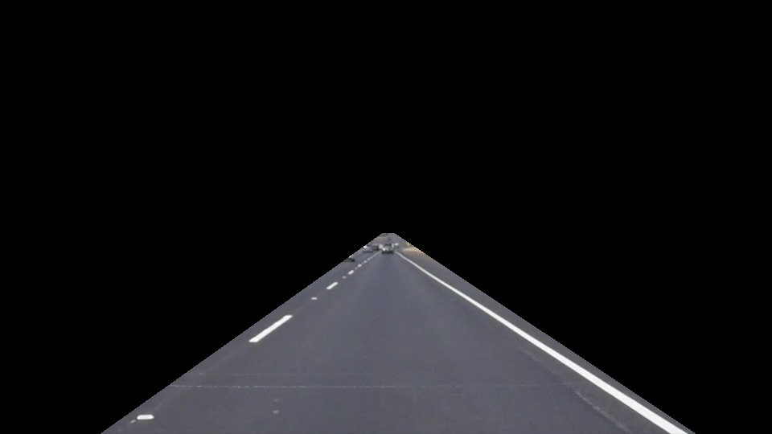
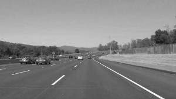
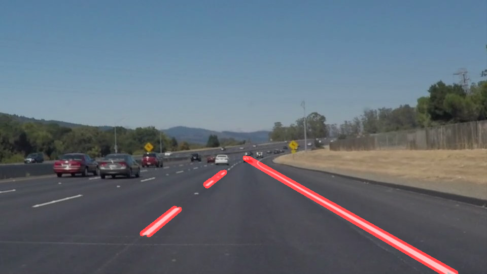
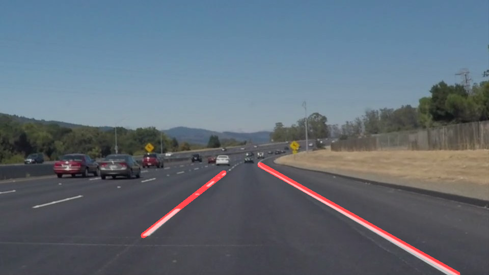

#**Finding Lane Lines on the Road** 

---

**Finding Lane Lines on the Road**

The goals / steps of this project are the following:
* Make a pipeline that finds lane lines on the road
* Apply the pipeline on the video file.

[//]: # (Image References)

[image1]: ./examples/cuttedimg.jpg "Image with the interested region"

---

### Reflection

#1. 
My lane line detection pipe-line consisted of 5 steps including pre-lookup step. 

First I tried to figure out the regio that I'm interested in. Although we need to do actual cutting later on it is much easier to figure out interesting region with original image. 

Secondly we need to convert image to gray scale

We need this process because it make much easier to detect white lane on the gray scaled image rather than colored image

Third we make a canny transformation In this procedure there is several mini steps;

     1. Make Gaussian blur transform. By blurring we can focus on the lane among the other obstacles(cars,tree) 
     
     2. Detecting edge with canny transform. We can detect edge of lane only choose the pixel meet certain threshold.
         
     3. Cut the image except region that we are interested in .

  
  
For the Final step we make hough transformation

At first I just apply houghp transformation on the whole image but it show only seperated line after transformation

To overcome this drawback I improve draw_lines() funcitons with following strategies

    1. Rather than try to detect the line all at ones. Try to seperate left lane detecting process and right lane 
    2. Get all the endpoints of the liness detected by houghp transformation connect all the endpoints and estimate the slope of new line
    

#2. Potential shortcomings 

My pipeline heavily depend on the cutting images but the range of the lane on the image are not stable. So it can make many errors. 

#3. Possible improvements 

It will be better to connect middle point rather than endpoint of pixel to connect seperated lines